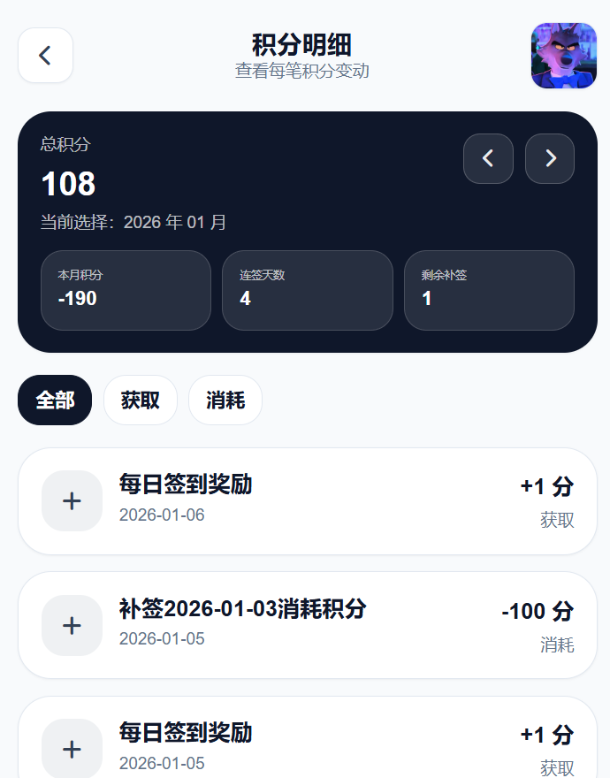
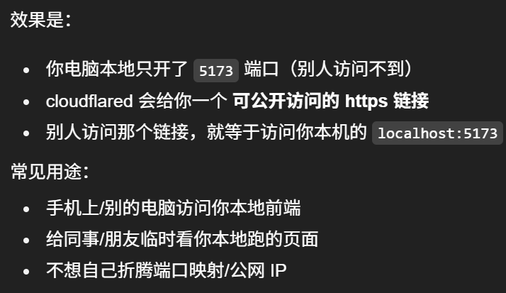
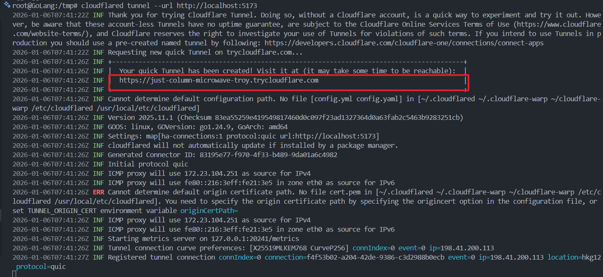
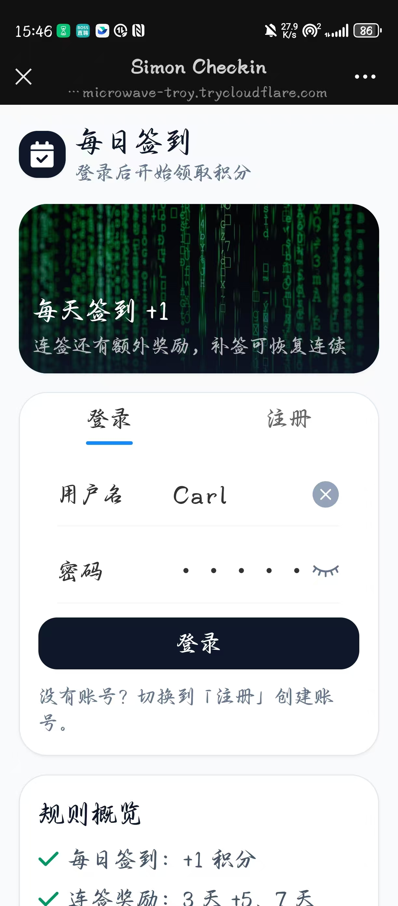
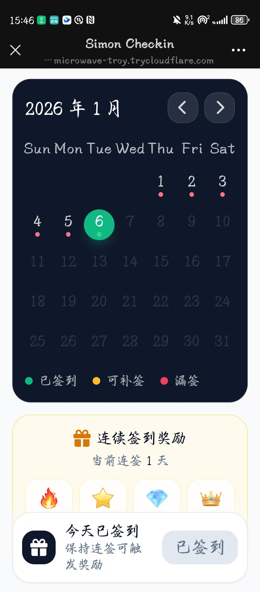
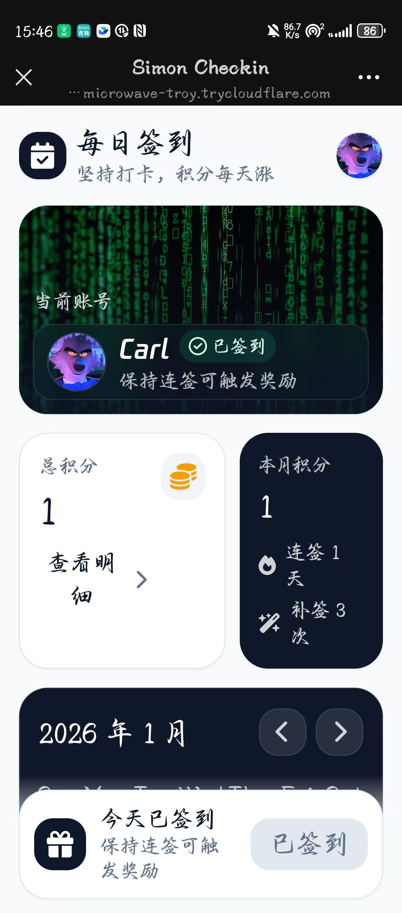
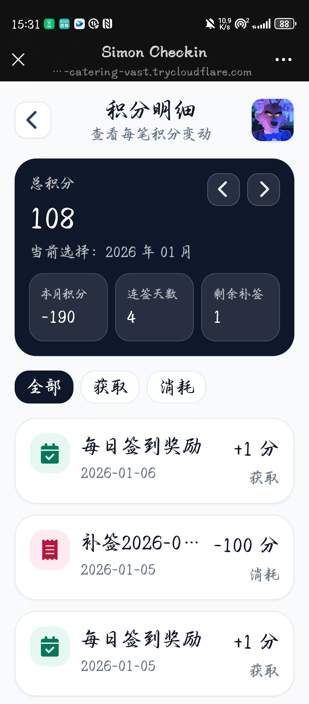
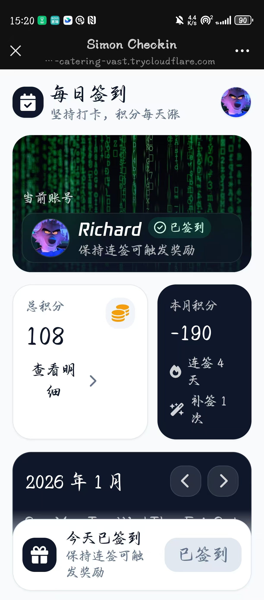

# goframProj
一个 Go Web 实战项目，基于 goframe+Vue3 + Vite 开发的签到中心系统。 从零开始搭建一个完整的 Web 项目。

# 目录结构
```
├─api.json                  // 接口文档
├─backend                   // 后端代码
├─frontend                  // 前端代码
└─README.md                 // 项目说明文件
```

# 技术栈
# 后端（backend）
GoFrame：用于快速开发Go语言项目，提供丰富的功能模块和中间件。
Redis：用于缓存。
MySQL：用于存储数据。
Snowflake：用于生成全局唯一ID。
# 前端（frontend）
Vue3：最新的Vue版本，提供了更强大的功能和更好的性能。
Vite：下一代前端开发与构建工具，支持热更新等功能。
# 运行
请看goframProj/README.md
# 本地演示效果
- 账户Henry


- 另一个账户Richard


# 手机端访问演示效果
- 一个终端
```
cd /tmp
wget -O cloudflared.deb https://github.com/cloudflare/cloudflared/releases/latest/download/cloudflared-linux-amd64.deb
sudo dpkg -i cloudflared.deb
cloudflared --version
root@GoLang:/tmp# cloudflared tunnel --url http://localhost:5173
```
cloudflared tunnel --url http://localhost:5173

这一步是在启动 Cloudflare Tunnel（临时隧道）：
把你本机的 http://localhost:5173（通常是 Vite 前端开发服务器）通过 Cloudflare 的网络映射到公网。





手机端直接访问https://just-column-microwave-troy.trycloudflare.com 即可

- 另一个终端开后端
```
root@GoLang:~/proj/proj2/goframProj/backend# go run main.go
```
- 另一个终端开前端
```
root@GoLang:~/proj/proj2/goframProj/frontend# npm run dev -- --host 0.0.0.0 --port 5173
```









